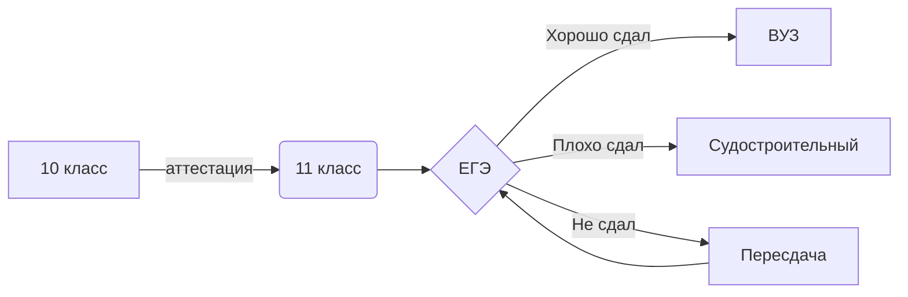

Сподина Анастасия 

$$m=\rho\cdot V$$

$$V_{1} = \sqrt{\frac{G\cdot M}{R+h}}$$

$$F = m\cdot a$$

```mermaid 
flowchart LR
A[10 класс] -->|аттестация| B(11 класс)
B --> C{ЕГЭ}
C -->|Хорошо сдал| D[ВУЗ]
C -->|Плохо сдал| E[Судостроительный]
C -->|Не сдал| F[Пересдача]
F --> C
```
